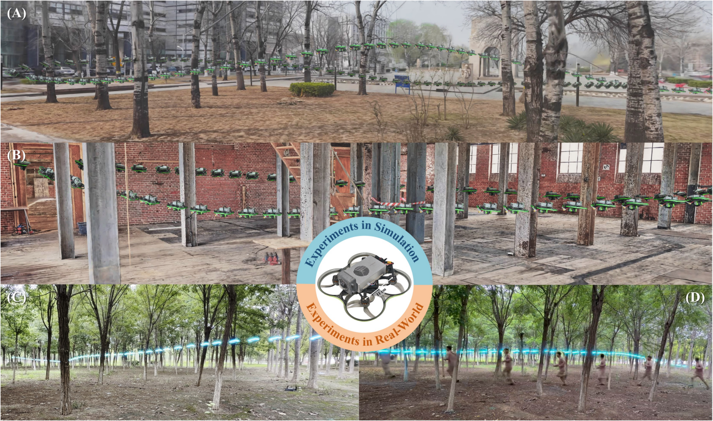
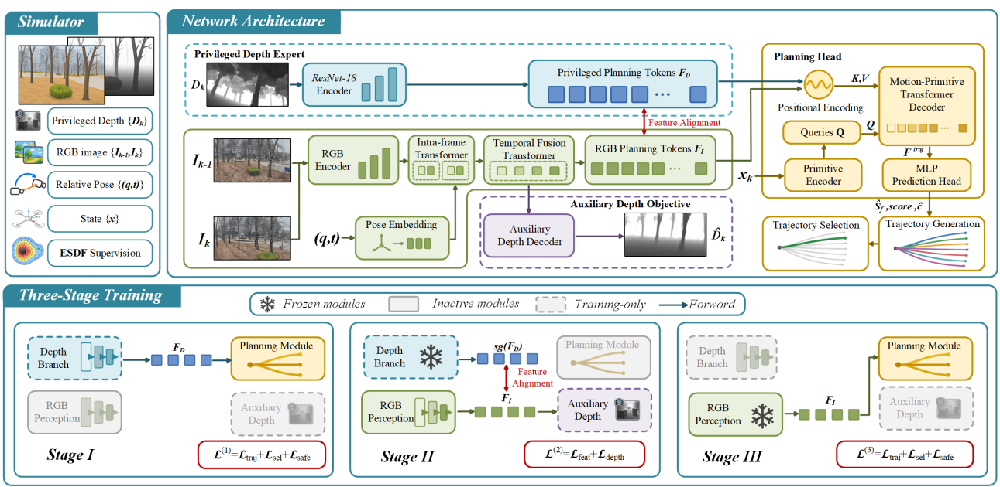
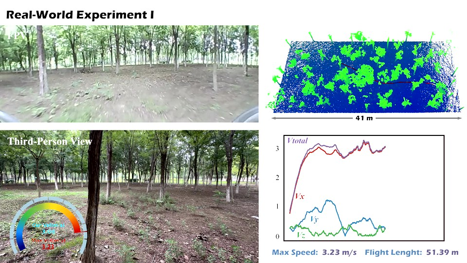

# Learning Geometry-Aware Planning Representations for Monocular Flight with Cross-Modal Supervision

[English](README.md) | [简体中文](README.zh-CN.md)

🎬 [Watch the demo video on my personal homepage](https://mioulo.github.io/)

> 📌 **Project status:** This repository presents the method and flight demonstrations accompanying our manuscript, which has not yet been accepted for publication. Source code and model weights are not publicly available at this stage. Any future release will be announced here.

## 🚁 Overview

We study agile quadrotor flight using a monocular RGB camera for obstacle perception. Our planner takes **two consecutive RGB images, their metric relative pose, and the vehicle state** as input and directly generates a smooth trajectory toward a goal.

The central idea is to learn **geometry-aware representations tailored to planning**. During training, a privileged depth expert transfers its planning features to the RGB planner through cross-modal supervision. An auxiliary coarse-depth objective provides additional geometric regularization. At deployment, the depth expert and auxiliary depth decoder are removed: the planner uses RGB observations, relative pose, and vehicle state without explicitly reconstructing depth.

The planner is trained in 3D Gaussian Splatting (3DGS) simulation and deployed to real-world environments **without real-world fine-tuning**.

## 🧠 Method

The framework combines pose-conditioned temporal RGB fusion, a shared motion-primitive decoder, and a progressive training strategy:

1. **Depth planning pretraining.** Train a privileged depth expert and the shared planning modules using trajectory objectives.
2. **Cross-modal supervision.** Freeze the depth expert and shared planner, and train the RGB branch with planning-feature alignment and auxiliary coarse-depth supervision.
3. **RGB planning adaptation.** Freeze the RGB perception branch and adapt the shared planning modules to its distilled representation using trajectory objectives.

At inference, the network predicts candidate motion primitives, selection scores, and collision costs. It shortlists candidates by score and selects a trajectory using the predicted collision cost together with online smoothness and goal costs. Each selected primitive is realized as a single-segment quintic polynomial trajectory.

## 📊 Experimental Results

### 🌲 Simulation

The following ablation results are reported in Table I of the manuscript at a **desired speed of 6 m/s**, with **40 trials per method in each environment**. Test scenes are held out from training. Average speeds include both successful and unsuccessful trials.

| Method | Forest success | Facility success | Average success | Average speed |
| --- | ---: | ---: | ---: | ---: |
| Depth Oracle | 100.0% | 100.0% | 100.0% | 4.65 m/s |
| RGB Baseline | 72.5% | 32.5% | 52.5% | 4.56 m/s |
| RGB + Feature Alignment | 80.0% | 70.0% | 75.0% | 4.57 m/s |
| Temporal RGB + Feature Alignment | 85.0% | 75.0% | 80.0% | 5.21 m/s |
| **Proposed** | **90.0%** | **92.5%** | **91.3%** | **5.30 m/s** |

*Depth Oracle uses simulator-provided depth and serves as a privileged reference. The other methods use RGB observations for planning.*

### ⚡ Real-World Deployment

| Item | Configuration / result |
| --- | --- |
| Onboard computer | NVIDIA Jetson Orin NX |
| Visual sensor | Monocular fisheye camera |
| Planning image | 640 × 240 cylindrical projection; 160° × 55° field of view |
| State estimation | VINS-Mono using the calibrated fisheye stream and IMU |
| Network inference latency | 9.5 ms with TensorRT |
| Planning frequency | 15 Hz |
| Maximum obstacle-avoidance speed | Approximately 6.5 m/s |
| Transfer | Simulation training; no real-world fine-tuning |

The state-estimation, planning, and control pipeline runs onboard. Although obstacle perception uses a monocular camera, the planner also requires metric relative pose and vehicle state supplied by state estimation.

## 📦 Availability

This is a **demonstration repository** containing method illustrations and a link to the flight demonstration. It does not currently provide a runnable implementation, training scripts, or pretrained model weights.

Any future code or model release will be announced in this repository.

---

*Click the preview to visit my personal homepage and view the demonstration video.*

The video introduces the network and training pipeline, then demonstrates:

- **Simulation flight** in an industrial facility and a forest, with onboard, chase, and third-person views.
- **Real-world forest obstacle avoidance** across three flight runs at different speeds, with onboard views, trajectory visualizations, and velocity profiles.
- **High-speed flight** reaching approximately **6.5 m/s** in the real world.

The paper additionally evaluates replanning under continuously updated goal directions using a person-tracking module.
